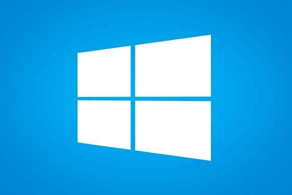
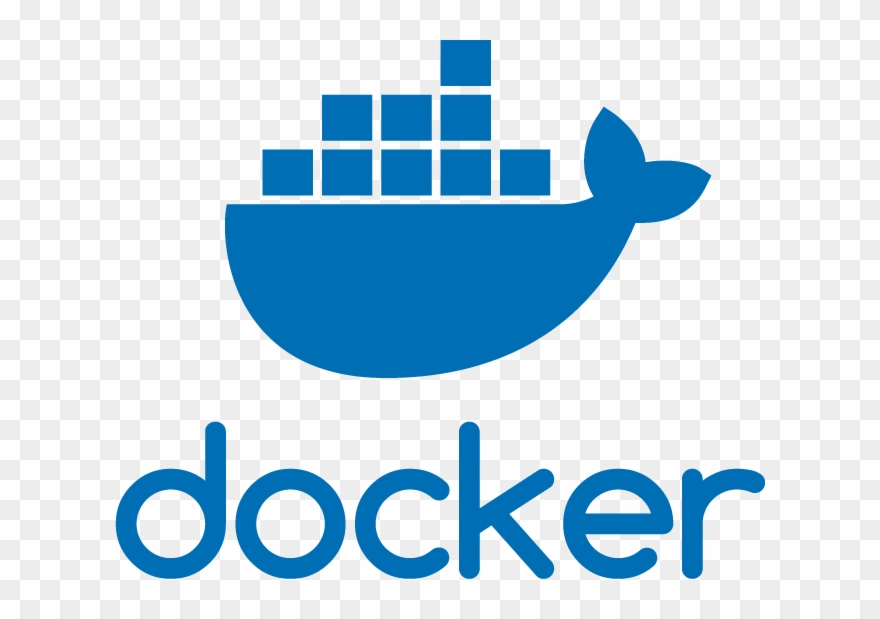

#  BINGO Hackaton

This is intended to be a course on cosmological code for modern observational cosmology aiming graduate students.

You will fild here hands on lessons and detailed instruction to build your own system with docker.

This system provides:
- camb
- class
- CosmoMC
- MontePython
- Cosmosis
- Cobaya
- CosmoHammer

You should start learning [here](lessonsTOC.ipinb):  

## I am in a hurry:

````bash
git clone https://github.com/lbarosi/BINGO-Hackaton.git
cd BINGO-Hackaton
make build
make run  
````
**Open your browser and navigate to http://localhost:8888**

**WARNING**: building the docker image the first time may take almost 1 hour!

## BINGO Hackaton

## Preliminares

###  GIT
#### Installation
1.  Linux Systems

     ````bash
     sudo apt install git
     git --version
     git config --global user.name "John Doe"
     git config --global user.email "jdoe@email"
     ````
2.  Mac OSX

Firs install **brew** and then **git**
````bash
/usr/bin/ruby -e "$(curl -fsSL https://raw.githubusercontent.com/Homebrew/install/master/install)"
brew install git
````
3.  Windows
     https://gitforwindows.org/


#### Cloud Git
There are several GIT repositories:

 [GitHUB](https://github.com/)
 [BitBucket](https://bitbucket.org/)

#### Useful Commands

| Goal | command |
|------|---------|
|  create local repo    |````git init ````|
|  clone remote repo    |````git clone john@host:/path ````|
|  add files    |````git add * ````|
|  commit your changes    |````git commit -m "message" ````|
|  send changes to remote    |````git push origin master ````|
|  fetch from remote and merge    |````git pull ````|

###  DOCKER

#### Installation

1.  Linux Systems
````bash
sudo apt update
sudo apt install apt-transport-https ca-certificates curl software-properties-common
curl -fsSL https://download.docker.com/linux/ubuntu/gpg | sudo apt-key add -
apt-repository "deb [arch=amd64] https://download.docker.com/linux/ubuntu bionic stable"
sudo apt update
sudo apt install docker-ce
````
After install you should allow non-root users:
````bash
sudo systemctl status docker
sudo usermod -aG docker ${USER}
````
Restart your session.

2.  Mac OSX

https://hub.docker.com/?overlay=onboarding

3.  Windows

https://hub.docker.com/?overlay=onboarding

#### Useful Commands

| Goal | command |
|------|---------|
|  list images    |````docker images ````|
|  list containers    |````docker container ls ````|
|  build image    |````docker build --tag=name . ````|
|  run containers    |````docker run --init -ti imagename /bin/bash  ````|
|  remove image    |````docker rmi -f imagename ````|
|  prune (use with care)   |````docker system prune --filter "until=24h"````|
|  commit changes   |````docker commit CONTAINER IMAGE ````|


## Starting to Work

### Cloning the repo

````bash
git clone https://lbarosi@bitbucket.org/lbarosi/bingo-hackaton.git
cd bingo-Hackaton
git checkout
````

### Making the container
````bash
cd bingo-Hackaton
time docker build -t lbarosi/cosmos:v1 .
````
**real    45m22,561ss**


### Running the container and further installs


````bash
docker run --rm --mount type=bind,source=$(SOURCE),target=$(TARGET) $(IMAGE):$(TAG)
````


#### Checking What we have so far

1.  Docker IMAGE
2.  Linux UBUNTU system
3.  Gnu compilers
4.  Python3 and Python2 installed
5.  Conda manager
5.  Jupyter Notebook

## We are Ready for Cosmology

- Open your browser and point to http://localhost:8888 and use the password to access the jupyter Notebook.

- Open the notebook [lessonsTOC.ipynb](./lessonsTOC.ipynb)
